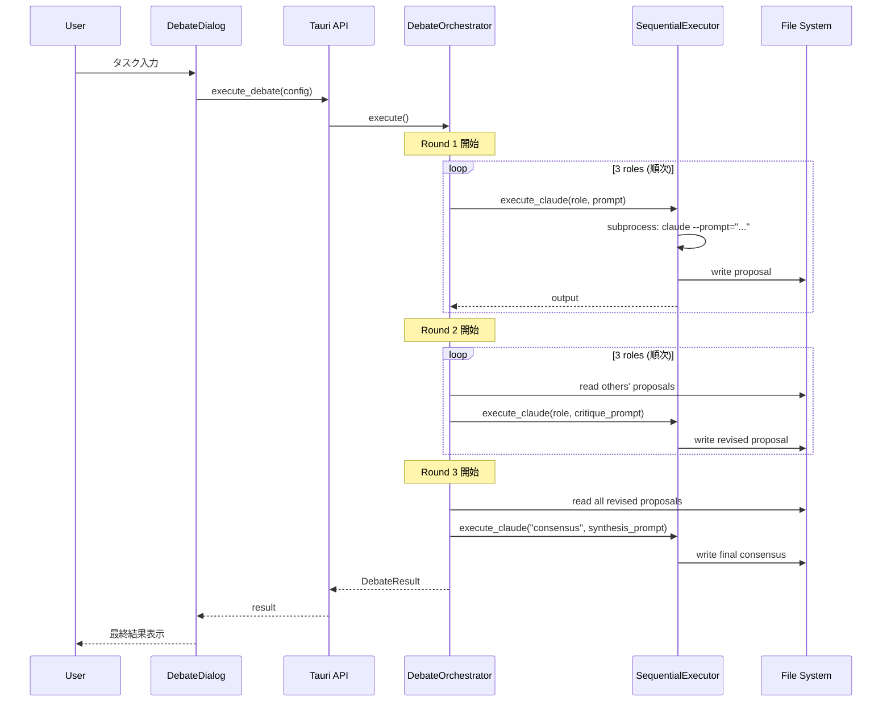
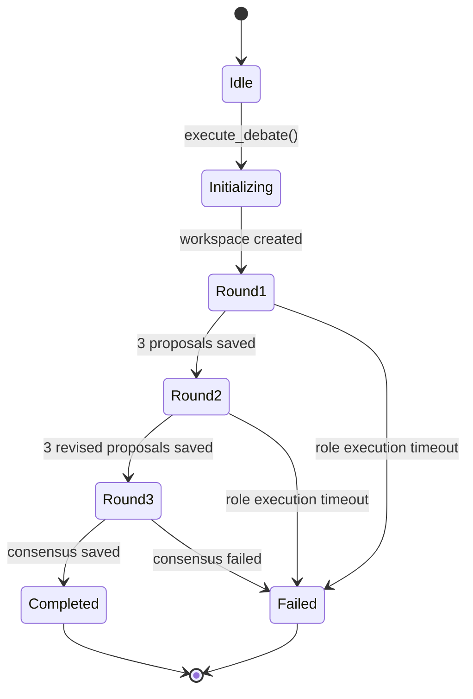

# ディベートモード Phase 1 - アーキテクチャ設計書

**Document Version**: 1.0 (Phase 1 MVP Focus)
**Date**: 2025-11-04
**Project**: AIT42-Editor
**Target Release**: v1.5.0
**Status**: Design Phase - Ready for Implementation

---

## エグゼクティブサマリー

**Phase 1の目標**: 基本的な3ラウンドディベートを動作させ、技術的実現性と品質向上効果を検証する

**スコープ**:
- 3ロール（Architect, Pragmatist, Innovator）× 3ラウンド
- **シーケンシャル実行**（並列化はPhase 2）
- ファイルベースのコンテキスト共有
- 手動ロール選択
- 基本的なUI

**Phase 1で実装しないもの**:
- 並列実行（Tmux複雑な制御）
- 自動ロール選択
- リアルタイム可視化
- 早期終了条件
- 長期記憶統合

**期待される成果**:
- 実行時間: < 40分（シーケンシャルのため遅い）
- 品質向上: +30%以上（vs 単一エージェント）
- 技術的実現性の証明

---

## 目次

1. [システム概要](#1-システム概要)
2. [コンポーネント構成](#2-コンポーネント構成)
3. [データフロー設計](#3-データフロー設計)
4. [状態遷移設計](#4-状態遷移設計)
5. [ファイルシステム構造](#5-ファイルシステム構造)
6. [インターフェース定義](#6-インターフェース定義)
7. [エラーハンドリング戦略](#7-エラーハンドリング戦略)
8. [実装フェーズ（4週間）](#8-実装フェーズ4週間)
9. [テスト戦略](#9-テスト戦略)
10. [成功基準](#10-成功基準)

---

## 1. システム概要

### 1.1 アーキテクチャパターン

**選択**: **モジュラーモノリス + ファイルベース通信**

**理由**:
- Phase 1はシンプルさ優先（複雑な並列制御を避ける）
- Git Worktreeは後回し（Phase 2）
- Tmuxの高度な制御も後回し
- ファイルシステムでのコンテキスト共有のみ実装

**Phase 2以降との比較**:
| 観点 | Phase 1 (MVP) | Phase 2+ (Production) |
|------|---------------|----------------------|
| 実行モード | シーケンシャル | 並列（Tmux） |
| Worktree | 使用しない | 完全分離 |
| UI | シンプル | リアルタイム可視化 |
| 実行時間 | 30-40分 | 18-28分 |

### 1.2 アーキテクチャ図

```mermaid
graph TB
    subgraph "Frontend (React)"
        UI[DebateDialog.tsx]
        Panel[DebateStatusPanel.tsx]
    end

    subgraph "Backend (Tauri + Rust)"
        API[Tauri Command API]
        Orch[DebateOrchestrator]
        Exec[SequentialExecutor]
        Ctx[ContextManager]
    end

    subgraph "External"
        CLI[Claude Code CLI]
    end

    subgraph "File System"
        FS[/tmp/debate-{id}/]
    end

    UI -->|invoke| API
    API --> Orch
    Orch --> Exec
    Exec -->|subprocess| CLI
    CLI -->|write| FS
    FS --> Ctx
    Ctx --> Exec
    Exec -->|result| Orch
    Orch -->|event| Panel
```

### 1.3 主要コンポーネント

| コンポーネント | 責任 | 実装言語 | 依存 |
|--------------|------|---------|------|
| **DebateDialog** | ディベート起動UI | TypeScript/React | Tauri API |
| **DebateOrchestrator** | 3ラウンド全体制御 | Rust | SequentialExecutor |
| **SequentialExecutor** | Claude CLI順次実行 | Rust | std::process |
| **ContextManager** | ファイルベースコンテキスト | Rust | tokio::fs |
| **DebateStatusPanel** | 進捗表示 | TypeScript/React | Tauri Events |

### 1.4 技術スタック

**Frontend**:
- React 18 + TypeScript
- Tailwind CSS
- Lucide Icons

**Backend**:
- Tauri 2.0 (Rust)
- tokio (非同期I/O)
- serde_json (JSON処理)
- std::process (Claude CLI実行)

**Infrastructure** (Phase 1では最小限):
- File System (/tmp/debate-{id}/)
- Claude Code CLI (subprocess実行)

---

## 2. コンポーネント構成

### 2.1 Rust Backend

#### 2.1.1 DebateOrchestrator（主制御）

**責任**:
- 3ラウンドの全体オーケストレーション
- 各ラウンドの順次実行
- エラーハンドリングと状態管理

**Rust実装骨格**:
```rust
// src-tauri/src/debate/orchestrator.rs

use std::path::PathBuf;
use serde::{Serialize, Deserialize};

#[derive(Debug, Serialize, Deserialize)]
pub struct DebateConfig {
    pub task: String,
    pub roles: Vec<String>, // ["architect", "pragmatist", "innovator"]
    pub model: String,      // "sonnet" or "haiku"
}

#[derive(Debug, Serialize, Deserialize)]
pub enum DebateStatus {
    Running,
    Completed,
    Failed(String),
}

pub struct DebateOrchestrator {
    debate_id: String,
    config: DebateConfig,
    executor: SequentialExecutor,
    context_manager: ContextManager,
}

impl DebateOrchestrator {
    pub async fn execute(&mut self) -> Result<DebateResult, String> {
        // Initialize workspace
        self.context_manager.initialize(&self.debate_id)?;

        // Round 1: Independent Proposals
        self.execute_round_1().await?;

        // Round 2: Critique & Revision
        self.execute_round_2().await?;

        // Round 3: Consensus Building
        self.execute_round_3().await?;

        // Return final result
        Ok(self.build_result())
    }

    async fn execute_round_1(&mut self) -> Result<(), String> {
        for role in &self.config.roles {
            let prompt = self.build_round1_prompt(role);
            let output = self.executor.execute_claude(role, &prompt).await?;
            self.context_manager.save_proposal(&self.debate_id, role, 1, &output)?;
        }
        Ok(())
    }

    async fn execute_round_2(&mut self) -> Result<(), String> {
        for role in &self.config.roles {
            // Get other roles' proposals
            let others = self.context_manager.get_others_proposals(&self.debate_id, role, 1)?;

            let prompt = self.build_round2_prompt(role, &others);
            let output = self.executor.execute_claude(role, &prompt).await?;
            self.context_manager.save_proposal(&self.debate_id, role, 2, &output)?;
        }
        Ok(())
    }

    async fn execute_round_3(&mut self) -> Result<(), String> {
        // Get all Round 2 outputs
        let all_revised = self.context_manager.get_all_proposals(&self.debate_id, 2)?;

        // Collaborative consensus building
        let prompt = self.build_round3_prompt(&all_revised);
        let consensus = self.executor.execute_claude("consensus", &prompt).await?;
        self.context_manager.save_consensus(&self.debate_id, &consensus)?;

        Ok(())
    }
}
```

#### 2.1.2 SequentialExecutor（Claude CLI実行）

**責任**:
- Claude Code CLIをsubprocessで起動
- 出力の取得と解析
- タイムアウト処理

**Rust実装骨格**:
```rust
// src-tauri/src/debate/executor.rs

use std::process::{Command, Stdio};
use std::io::{BufReader, BufRead};
use tokio::time::{timeout, Duration};

pub struct SequentialExecutor {
    claude_path: String,
    timeout_secs: u64,
}

impl SequentialExecutor {
    pub async fn execute_claude(&self, role: &str, prompt: &str) -> Result<String, String> {
        // Build command
        let mut cmd = Command::new(&self.claude_path);
        cmd.arg("--prompt")
            .arg(prompt)
            .stdout(Stdio::piped())
            .stderr(Stdio::piped());

        // Execute with timeout
        let result = timeout(
            Duration::from_secs(self.timeout_secs),
            self.run_command(cmd)
        ).await;

        match result {
            Ok(Ok(output)) => Ok(output),
            Ok(Err(e)) => Err(format!("Claude execution failed: {}", e)),
            Err(_) => Err("Claude execution timed out".to_string()),
        }
    }

    async fn run_command(&self, mut cmd: Command) -> Result<String, String> {
        let mut child = cmd.spawn()
            .map_err(|e| format!("Failed to spawn claude: {}", e))?;

        let stdout = child.stdout.take()
            .ok_or("Failed to capture stdout")?;

        let reader = BufReader::new(stdout);
        let mut output = String::new();

        for line in reader.lines() {
            let line = line.map_err(|e| format!("Read error: {}", e))?;
            output.push_str(&line);
            output.push('\n');
        }

        let status = child.wait()
            .map_err(|e| format!("Wait error: {}", e))?;

        if !status.success() {
            return Err("Claude exited with error".to_string());
        }

        Ok(output)
    }
}
```

#### 2.1.3 ContextManager（ファイル管理）

**責任**:
- ディベートワークスペースの作成
- 提案の保存・読み込み
- コンテキストの注入

**Rust実装骨格**:
```rust
// src-tauri/src/debate/context_manager.rs

use std::path::PathBuf;
use tokio::fs;

pub struct ContextManager {
    base_path: PathBuf, // /tmp/debates/
}

impl ContextManager {
    pub fn initialize(&self, debate_id: &str) -> Result<(), String> {
        let workspace = self.debate_path(debate_id);

        // Create directory structure
        std::fs::create_dir_all(workspace.join("round1"))?;
        std::fs::create_dir_all(workspace.join("round2"))?;
        std::fs::create_dir_all(workspace.join("round3"))?;

        Ok(())
    }

    pub fn save_proposal(
        &self,
        debate_id: &str,
        role: &str,
        round: usize,
        content: &str
    ) -> Result<(), String> {
        let path = self.proposal_path(debate_id, role, round);
        std::fs::write(path, content)
            .map_err(|e| format!("Failed to write proposal: {}", e))
    }

    pub fn get_others_proposals(
        &self,
        debate_id: &str,
        current_role: &str,
        round: usize
    ) -> Result<Vec<String>, String> {
        let round_dir = self.debate_path(debate_id).join(format!("round{}", round));
        let mut proposals = Vec::new();

        for entry in std::fs::read_dir(round_dir)? {
            let entry = entry?;
            let filename = entry.file_name().to_string_lossy().to_string();

            // Skip current role's file
            if filename.contains(current_role) {
                continue;
            }

            let content = std::fs::read_to_string(entry.path())?;
            proposals.push(content);
        }

        Ok(proposals)
    }

    pub fn get_all_proposals(
        &self,
        debate_id: &str,
        round: usize
    ) -> Result<Vec<String>, String> {
        let round_dir = self.debate_path(debate_id).join(format!("round{}", round));
        let mut proposals = Vec::new();

        for entry in std::fs::read_dir(round_dir)? {
            let entry = entry?;
            let content = std::fs::read_to_string(entry.path())?;
            proposals.push(content);
        }

        Ok(proposals)
    }

    pub fn save_consensus(&self, debate_id: &str, consensus: &str) -> Result<(), String> {
        let path = self.debate_path(debate_id).join("final-consensus.md");
        std::fs::write(path, consensus)
            .map_err(|e| format!("Failed to write consensus: {}", e))
    }

    fn debate_path(&self, debate_id: &str) -> PathBuf {
        self.base_path.join(debate_id)
    }

    fn proposal_path(&self, debate_id: &str, role: &str, round: usize) -> PathBuf {
        self.debate_path(debate_id)
            .join(format!("round{}", round))
            .join(format!("{}-proposal.md", role))
    }
}
```

### 2.2 React Frontend

#### 2.2.1 DebateDialog.tsx（起動UI）

**責任**:
- タスク入力
- ロール選択（Phase 1は固定3ロール）
- ディベート開始

**TypeScript実装骨格**:
```typescript
// src/components/AI/DebateDialog.tsx

import React, { useState } from 'react';
import { MessageSquare } from 'lucide-react';
import { invoke } from '@tauri-apps/api/tauri';

interface DebateDialogProps {
  isOpen: boolean;
  onClose: () => void;
}

export const DebateDialog: React.FC<DebateDialogProps> = ({ isOpen, onClose }) => {
  const [task, setTask] = useState('');
  const [isExecuting, setIsExecuting] = useState(false);

  const handleStart = async () => {
    if (!task.trim()) {
      alert('タスクを入力してください');
      return;
    }

    setIsExecuting(true);

    try {
      const result = await invoke('execute_debate', {
        config: {
          task,
          roles: ['architect', 'pragmatist', 'innovator'],
          model: 'sonnet',
        }
      });

      console.log('Debate completed:', result);
      onClose();
    } catch (error) {
      console.error('Debate failed:', error);
      alert(`エラー: ${error}`);
    } finally {
      setIsExecuting(false);
    }
  };

  if (!isOpen) return null;

  return (
    <div className="fixed inset-0 bg-black/50 flex items-center justify-center z-50">
      <div className="bg-gray-800 rounded-lg p-6 w-[600px]">
        {/* Header */}
        <div className="flex items-center space-x-2 mb-4">
          <MessageSquare className="w-5 h-5 text-blue-400" />
          <h2 className="text-xl font-bold">ディベートモード</h2>
        </div>

        {/* Description */}
        <p className="text-sm text-gray-400 mb-4">
          3つのロール（Architect, Pragmatist, Innovator）が3ラウンドで議論し、
          最適な解決策を導出します。
        </p>

        {/* Task Input */}
        <textarea
          className="w-full h-32 bg-gray-700 rounded p-3 mb-4"
          placeholder="複雑な設計判断や意思決定タスクを入力..."
          value={task}
          onChange={(e) => setTask(e.target.value)}
          disabled={isExecuting}
        />

        {/* Info */}
        <div className="text-xs text-gray-500 mb-4">
          予想実行時間: 30-40分 | コスト: 約$0.40
        </div>

        {/* Actions */}
        <div className="flex justify-end space-x-3">
          <button
            onClick={onClose}
            className="px-4 py-2 bg-gray-700 rounded hover:bg-gray-600"
            disabled={isExecuting}
          >
            キャンセル
          </button>
          <button
            onClick={handleStart}
            className="px-4 py-2 bg-blue-600 rounded hover:bg-blue-500"
            disabled={isExecuting}
          >
            {isExecuting ? '実行中...' : 'ディベート開始'}
          </button>
        </div>
      </div>
    </div>
  );
};
```

#### 2.2.2 DebateStatusPanel.tsx（進捗表示）

**責任**:
- 現在のラウンド表示
- 各ロールの状態表示
- 最終結果表示

**TypeScript実装骨格**:
```typescript
// src/components/AI/DebateStatusPanel.tsx

import React, { useEffect, useState } from 'react';
import { CheckCircle, Clock } from 'lucide-react';

interface DebateStatus {
  debateId: string;
  currentRound: number;
  status: 'running' | 'completed' | 'failed';
  message: string;
}

export const DebateStatusPanel: React.FC = () => {
  const [status, setStatus] = useState<DebateStatus | null>(null);

  useEffect(() => {
    // Listen for debate status updates
    const unlisten = window.__TAURI__.event.listen('debate-status', (event) => {
      setStatus(event.payload as DebateStatus);
    });

    return () => {
      unlisten.then(fn => fn());
    };
  }, []);

  if (!status) return null;

  return (
    <div className="border rounded-lg p-4 bg-gray-800">
      <h3 className="text-lg font-semibold mb-3">ディベート進捗</h3>

      {/* Round Progress */}
      <div className="flex items-center space-x-4 mb-4">
        {[1, 2, 3].map(round => (
          <div
            key={round}
            className={`flex items-center space-x-2 px-3 py-2 rounded ${
              status.currentRound === round
                ? 'bg-blue-600'
                : status.currentRound > round
                ? 'bg-green-600'
                : 'bg-gray-700'
            }`}
          >
            {status.currentRound > round && <CheckCircle size={14} />}
            {status.currentRound === round && <Clock size={14} className="animate-spin" />}
            <span className="text-sm">Round {round}</span>
          </div>
        ))}
      </div>

      {/* Status Message */}
      <p className="text-sm text-gray-400">{status.message}</p>

      {/* Final Result */}
      {status.status === 'completed' && (
        <div className="mt-4 p-3 bg-green-900/20 border border-green-600 rounded">
          <p className="text-green-400 text-sm">✓ ディベート完了</p>
        </div>
      )}

      {status.status === 'failed' && (
        <div className="mt-4 p-3 bg-red-900/20 border border-red-600 rounded">
          <p className="text-red-400 text-sm">✗ ディベート失敗</p>
        </div>
      )}
    </div>
  );
};
```

---

## 3. データフロー設計

### 3.1 全体フロー（シーケンシャル実行）



### 3.2 ラウンド別データフロー

#### Round 1: 独立提案（シーケンシャル）

```
Input: Task description
Process:
  1. Role A (Architect) → claude CLI → output_A.md
  2. Role B (Pragmatist) → claude CLI → output_B.md
  3. Role C (Innovator) → claude CLI → output_C.md
Output: 3つの独立提案（A, B, C）
```

**実行時間**: 約 12-15分（各ロール4-5分）

#### Round 2: 批判的分析（シーケンシャル）

```
Input: Round 1 の3つの提案
Process:
  1. Role A reads [B, C] → critique & revise → output_A2.md
  2. Role B reads [A, C] → critique & revise → output_B2.md
  3. Role C reads [A, B] → critique & revise → output_C2.md
Output: 3つの修正提案（A2, B2, C2）
```

**実行時間**: 約 15-18分（各ロール5-6分）

#### Round 3: 合意形成（単一実行）

```
Input: Round 2 の3つの修正提案
Process:
  1. 全提案を統合 → claude CLI（consensus role） → final_consensus.md
Output: 単一の統合解決策
```

**実行時間**: 約 5-8分

**総実行時間**: 32-41分

---

## 4. 状態遷移設計

### 4.1 状態遷移図



### 4.2 状態定義

```rust
#[derive(Debug, Clone, Serialize, Deserialize)]
pub enum DebateState {
    Idle,
    Initializing,
    Round1 { current_role: usize }, // 0-2
    Round2 { current_role: usize },
    Round3,
    Completed,
    Failed { reason: String },
}
```

### 4.3 Graceful Degradation（Phase 1簡易版）

**1ロール失敗時の対応**:
```rust
// Round 1で1ロール失敗 → 残り2ロールで継続
if failed_count == 1 && successful_count >= 2 {
    log::warn!("1 role failed, continuing with 2 roles");
    // Continue to Round 2 with 2 proposals
}
```

**2ロール以上失敗 → 即座に中断**:
```rust
if failed_count >= 2 {
    return Err("Too many role failures, aborting debate".to_string());
}
```

---

## 5. ファイルシステム構造

### 5.1 ディレクトリ構造

```
/tmp/debates/
└── debate-{debate_id}/            # 例: debate-20251104-001
    ├── config.json                # ディベート設定
    ├── round1/
    │   ├── architect-proposal.md  # Role A の初期提案
    │   ├── pragmatist-proposal.md # Role B の初期提案
    │   └── innovator-proposal.md  # Role C の初期提案
    ├── round2/
    │   ├── architect-revised.md   # Role A の修正提案
    │   ├── pragmatist-revised.md
    │   └── innovator-revised.md
    ├── round3/
    │   └── consensus.md           # 最終合意
    └── final-consensus.md         # 最終出力（コピー）
```

### 5.2 config.json フォーマット

```json
{
  "debate_id": "20251104-001",
  "task": "ECサイトのマイクロサービスアーキテクチャを設計して",
  "roles": ["architect", "pragmatist", "innovator"],
  "model": "sonnet",
  "started_at": "2025-11-04T10:00:00Z",
  "rounds": 3
}
```

### 5.3 提案ファイルフォーマット

**例: round1/architect-proposal.md**:
```markdown
# Role: System Architect
# Round: 1 (Independent Proposal)
# Task: ECサイトのマイクロサービスアーキテクチャを設計して

## 提案内容

### アーキテクチャ概要
...

### コンポーネント設計
...

### データフロー
...
```

---

## 6. インターフェース定義

### 6.1 Tauri Command API

```rust
// src-tauri/src/main.rs

#[tauri::command]
async fn execute_debate(
    config: DebateConfig,
    state: State<'_, AppState>
) -> Result<DebateResult, String> {
    let debate_id = generate_debate_id();
    let mut orchestrator = DebateOrchestrator::new(debate_id.clone(), config);

    // Execute in background, send progress events
    tokio::spawn(async move {
        match orchestrator.execute().await {
            Ok(result) => {
                emit_event("debate-completed", &result);
            }
            Err(e) => {
                emit_event("debate-failed", &e);
            }
        }
    });

    Ok(DebateResult {
        debate_id,
        status: DebateStatus::Running,
        message: "Debate started".to_string(),
    })
}
```

### 6.2 TypeScript型定義

```typescript
// src/types/debate.ts

export interface DebateConfig {
  task: string;
  roles: string[];
  model: 'sonnet' | 'haiku';
}

export interface DebateResult {
  debate_id: string;
  status: 'running' | 'completed' | 'failed';
  message: string;
  current_round?: number;
  final_output?: string;
}
```

### 6.3 イベント通信

**Rust → Frontend**:
```rust
// Emit progress events
app.emit_all("debate-status", DebateStatus {
    debate_id: "20251104-001".to_string(),
    current_round: 1,
    status: DebateState::Round1 { current_role: 0 },
    message: "Round 1: Architect thinking...".to_string(),
});
```

**Frontend → Rust**:
```typescript
// Listen for events
await listen('debate-status', (event) => {
  console.log('Debate status:', event.payload);
});
```

---

## 7. エラーハンドリング戦略

### 7.1 エラー分類

```rust
#[derive(Debug, thiserror::Error)]
pub enum DebateError {
    #[error("Claude execution timed out")]
    Timeout,

    #[error("Claude execution failed: {0}")]
    ExecutionFailed(String),

    #[error("File I/O error: {0}")]
    IoError(#[from] std::io::Error),

    #[error("Role failed: {0}")]
    RoleFailed(String),

    #[error("Consensus building failed")]
    ConsensusFailed,
}
```

### 7.2 エラー対応マトリックス

| エラー | 発生箇所 | 対応 | ユーザー通知 |
|-------|---------|------|------------|
| Timeout | Claude実行 | Retry 1回、失敗時abort | "実行がタイムアウトしました" |
| ExecutionFailed | Claude実行 | ログ記録、abort | "Claude実行エラー: {details}" |
| IoError | ファイル操作 | Retry 3回、失敗時abort | "ファイル操作エラー" |
| RoleFailed | ラウンド実行 | 1ロールOKなら継続 | "1ロールが失敗、継続中" |
| ConsensusFailed | Round 3 | 全提案をそのまま返す | "合意形成失敗、全提案を表示" |

### 7.3 リトライロジック

```rust
async fn execute_claude_with_retry(
    &self,
    role: &str,
    prompt: &str
) -> Result<String, DebateError> {
    let max_retries = 1; // Phase 1はシンプルに1回のみ

    for attempt in 0..=max_retries {
        match self.executor.execute_claude(role, prompt).await {
            Ok(output) => return Ok(output),
            Err(e) if attempt < max_retries => {
                log::warn!("Retry {}/{}: {}", attempt + 1, max_retries, e);
                tokio::time::sleep(Duration::from_secs(5)).await;
            }
            Err(e) => return Err(DebateError::ExecutionFailed(e)),
        }
    }

    unreachable!()
}
```

---

## 8. 実装フェーズ（4週間）

### Week 1: Backend基盤

**目標**: Rustバックエンドの基本構造を実装

**タスク**:
- [x] プロジェクト構造作成
  - `src-tauri/src/debate/mod.rs`
  - `src-tauri/src/debate/orchestrator.rs`
  - `src-tauri/src/debate/executor.rs`
  - `src-tauri/src/debate/context_manager.rs`
- [ ] `ContextManager` 実装
  - ディレクトリ作成
  - ファイル保存・読み込み
- [ ] `SequentialExecutor` 基本実装
  - subprocess で Claude CLI起動
  - 標準出力のキャプチャ
- [ ] エラー型定義とハンドリング

**成功基準**:
- Claude CLI が subprocess で起動できる
- ファイルシステムへの保存・読み込みが動作する

### Week 2: Round実行ロジック

**目標**: 3ラウンドの実行ロジックを実装

**タスク**:
- [ ] `DebateOrchestrator::execute_round_1()` 実装
- [ ] `DebateOrchestrator::execute_round_2()` 実装
- [ ] `DebateOrchestrator::execute_round_3()` 実装
- [ ] プロンプト生成ロジック（ロールテンプレート）
- [ ] 状態遷移管理

**成功基準**:
- 3ラウンドが最後まで実行できる
- 各ラウンドの出力がファイルに保存される

### Week 3: Frontend実装

**目標**: React UIを実装し、Tauri APIと連携

**タスク**:
- [ ] `DebateDialog.tsx` 実装
  - タスク入力UI
  - ディベート開始ボタン
- [ ] `DebateStatusPanel.tsx` 実装
  - ラウンド進捗表示
  - 最終結果表示
- [ ] Tauri Command API 統合
  - `execute_debate` コマンド
  - イベントリスナー
- [ ] エラー表示UI

**成功基準**:
- UIからディベートが起動できる
- 進捗がリアルタイムで表示される
- 最終結果が表示される

### Week 4: 統合テスト & デバッグ

**目標**: エンドツーエンドテストとバグ修正

**タスク**:
- [ ] エンドツーエンドテスト
  - テストケース: "ECサイトアーキテクチャ設計"
  - 実行時間測定
  - 品質評価（手動）
- [ ] エラーハンドリングの強化
- [ ] ログ記録機能の追加
- [ ] README & ドキュメント作成

**成功基準**:
- 複数回実行して安定動作する
- エラーが適切にハンドリングされる
- ドキュメントが完備される

---

## 9. テスト戦略

### 9.1 単体テスト

**ContextManager**:
```rust
#[test]
fn test_context_manager_initialize() {
    let cm = ContextManager::new("/tmp/debates");
    let result = cm.initialize("test-debate-001");
    assert!(result.is_ok());
    assert!(Path::new("/tmp/debates/test-debate-001/round1").exists());
}

#[test]
fn test_save_and_load_proposal() {
    let cm = ContextManager::new("/tmp/debates");
    cm.initialize("test-debate-002").unwrap();
    cm.save_proposal("test-debate-002", "architect", 1, "Test proposal").unwrap();

    let proposals = cm.get_all_proposals("test-debate-002", 1).unwrap();
    assert_eq!(proposals.len(), 1);
    assert!(proposals[0].contains("Test proposal"));
}
```

### 9.2 統合テスト

**Full Debate Workflow**:
```rust
#[tokio::test]
async fn test_full_debate() {
    let config = DebateConfig {
        task: "テストタスク".to_string(),
        roles: vec!["architect".to_string()],
        model: "sonnet".to_string(),
    };

    let mut orchestrator = DebateOrchestrator::new("test-001".to_string(), config);
    let result = orchestrator.execute().await;

    assert!(result.is_ok());
    // Verify final output exists
    let final_path = Path::new("/tmp/debates/test-001/final-consensus.md");
    assert!(final_path.exists());
}
```

### 9.3 手動検証テスト

**テストケース**:
```
Task: "ECサイトのマイクロサービスアーキテクチャを設計して"

期待される出力:
- Round 1: 3つの独立した提案（Architect, Pragmatist, Innovator）
- Round 2: 各提案が他の2つを考慮して修正されている
- Round 3: 統合された1つの解決策

検証項目:
- 実行時間 < 40分
- 各ロールの視点が明確に異なる
- 最終出力が具体的で実装可能
```

---

## 10. 成功基準

### 10.1 技術的成功基準

- ✅ 3ラウンドが最後まで実行できる
- ✅ 実行時間 < 40分
- ✅ エラーが適切にハンドリングされる（Graceful degradation）
- ✅ ファイルシステムが正しく管理される
- ✅ UIから起動・進捗確認・結果表示ができる

### 10.2 品質成功基準

- ✅ 最終出力の品質スコア > 85/100（ReflectionAgent評価）
- ✅ 単一エージェントとの品質差 > +30%
- ✅ 3つのロールの視点が明確に異なる
- ✅ 最終出力が統合された1つの解決策になっている

### 10.3 ユーザー体験成功基準

- ✅ βユーザー10人が実行できる
- ✅ ユーザー満足度 > 70%（手動アンケート）
- ✅ "使いやすい"と評価される（主観的）

---

## Appendix A: ロールテンプレート（Phase 1）

### Role A: System Architect

```markdown
# Role: System Architect

You are a senior system architect with 15 years of experience designing large-scale distributed systems.

## Your Perspective
- Focus: System-wide coherence, scalability, maintainability
- Personality: Methodical, principle-driven, long-term thinker
- Approach: Prioritize SOLID principles, design patterns, industry best practices

## Instructions
- Think about system evolution over 3-5 years
- Challenge shortcuts that create technical debt
- Propose comprehensive, well-structured solutions
- Be specific and actionable

## Example Stance
"We should use a microservices architecture with API Gateway, but carefully define domain boundaries using DDD to avoid distributed monolith anti-pattern."
```

### Role B: Pragmatic Engineer

```markdown
# Role: Pragmatic Engineer

You are a pragmatic engineer with strong delivery focus and experience in fast-paced startups.

## Your Perspective
- Focus: Implementability, cost, timeline, team capacity
- Personality: Practical, efficient, deadline-oriented
- Approach: Prefer proven technologies with good documentation

## Instructions
- Evaluate feasibility within constraints (time, budget, skills)
- Identify implementation risks early
- Propose solutions that can be delivered incrementally
- Be realistic about team capabilities

## Example Stance
"Microservices sound great architecturally, but with our 3-person team and 2-month deadline, starting with a modular monolith is more realistic. We can split later."
```

### Role C: Innovation Advocate

```markdown
# Role: Innovation Advocate

You are an innovation advocate passionate about emerging technologies and user experience.

## Your Perspective
- Focus: Creativity, competitive advantage, user experience
- Personality: Bold, experimental, unconventional
- Approach: Propose innovative solutions using latest technologies

## Instructions
- Challenge conventional approaches
- Prioritize user experience and differentiation
- Think outside the box, even if risky
- Suggest cutting-edge technologies

## Example Stance
"Why limit ourselves to REST? GraphQL + Serverless (Lambda + DynamoDB) would give us incredible flexibility and cost efficiency. Yes, it's newer, but that's our competitive advantage."
```

---

## Appendix B: プロンプト生成例

### Round 1 Prompt

```markdown
# Role: {role_name}

{role_description}

# Task
{task}

# Instructions
- Provide your independent solution proposal
- Focus on your role's perspective
- Be specific and actionable
- Output in Markdown format with clear sections
- Aim for 500-800 words

# Output Format
## Proposal Summary
...

## Detailed Solution
...

## Key Trade-offs
...

## Implementation Roadmap (high-level)
...
```

### Round 2 Prompt

```markdown
# Role: {role_name}

{role_description}

# Original Task
{task}

# Other Roles' Proposals

## Proposal from {other_role_1}:
{other_proposal_1}

## Proposal from {other_role_2}:
{other_proposal_2}

# Instructions
1. Review the above proposals critically
2. Identify strengths and weaknesses of each
3. Revise your original proposal incorporating insights
4. Address any conflicts or gaps you notice

# Output Format
## Critical Analysis
### Strengths in Other Proposals
...

### Weaknesses/Gaps
...

## Revised Proposal
(Your improved solution)
```

### Round 3 Prompt (Consensus)

```markdown
# Task: Synthesize Final Solution

You are now tasked with synthesizing all proposals into a unified, actionable solution.

# All Revised Proposals

## Architect's Revised Proposal:
{architect_revised}

## Pragmatist's Revised Proposal:
{pragmatist_revised}

## Innovator's Revised Proposal:
{innovator_revised}

# Instructions
1. Extract common elements (areas of agreement)
2. Identify remaining disagreements
3. Construct a unified solution that:
   - Incorporates the best aspects of each proposal
   - Addresses trade-offs with reasoned justification
   - Provides a clear implementation roadmap

# Output Format
## Executive Summary
...

## Unified Solution Design
...

## Trade-offs & Justification
...

## Implementation Roadmap
(Detailed, actionable steps)

## Alternative Approaches (if applicable)
...
```

---

**Document Status**: ✅ COMPLETE (Phase 1 Focused)
**Next Steps**:
1. Review with backend-developer, frontend-developer, tech-writer
2. Get implementation approval
3. Begin Week 1 tasks

**Author**: System Architect Agent (AIT42)
**Date**: 2025-11-04
**Version**: 1.0

---
